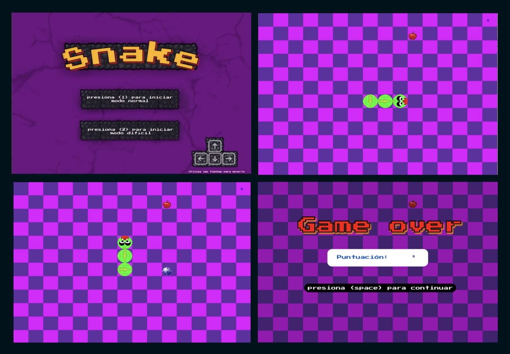

# Snake

## Equipo de desarrollo

- Ramiro Castro
- Jonas Gonzales 
- Agustina Esjaita
- persona
- etc

## Capturas

## Reglas de Juego / Instrucciones

### Decidimos traer el clasico juego de la viborita a wollok 

Para moverte utiliza las flechas del teclado, ¡procura agarrar todas las manzanas que puedas!

Cuenta con dos modos/niveles de dificultad; 
- el modo normal, que consta de agarrar las manzanas y evitar chocar para no morir
- el modo dificil, en el cual se implementan bombas (obstaculos) que debemos evitar para no morir; a mayor cantidad de manzanas, más bombas apareceran en el tablero.

## Otros

- Tecnicatura en Programación de Videojuegos - UNAHUR 
- Versión de wollok: 
- Una vez terminado, no tenemos problemas en que el repositorio sea público
